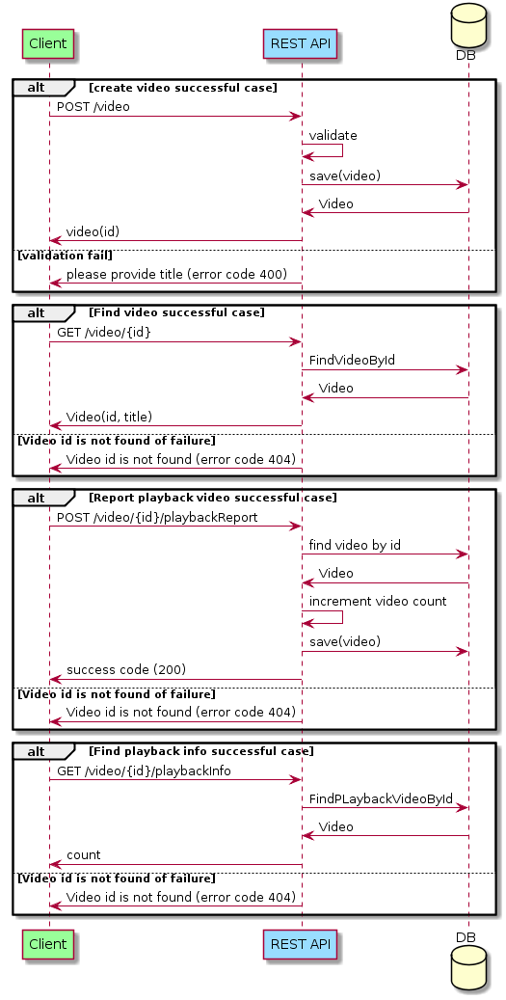

# Description
A client needs a rudimentary REST/JSON API to interact with.
The client would like to be able to call:
- Endpoints for creating and getting videos (where a video contains two pieces of information: id and title)
- Endpoints for reporting the playback start of a video and getting information of how many playbacks a video has

For specifics such as field and endpoint names you can refer to the test suite set up by the client developers to express their wishes.

# Please follow these steps:
- Run `mvn test` or load this project into your favourite IDE and run the tests from there.

## status codes
 200 video is created successfully  
 404 Video is not found for a given Id  
 400 Bad request, please provide title to create video  
 500 Unexpected Error  
 200 Success  
 201 video is created successfully  
 404 Video is not found for a given Id 
 

# REST API
The REST API to the sonic technical assessment is described below.

## Service Sequence Diagram

## Create video

##### Request

`POST /video`

    curl -v -H "Content-Type:application/json" -X POST http://localhost:8080/video -d '{"title": "Texas Metal"}'
    
##### Response

    * upload completely sent off: 24 out of 24 bytes
    HTTP/1.1 201
    Content-Type: application/json;charset=UTF-8
    Transfer-Encoding: chunked
    Date: Sun, 12 May 2019 14:53:46 GMT
    Connection #0 to host localhost left intact
    {"id":"80812657-b741-415f-a3b1-ba45a0e45aad","title":"Texas Metal","count":0}

## Get Video

##### Request

`GET /video/{id}`

    curl -i -H 'Accept: application/json' http://localhost:8080/video/80812657-b741-415f-a3b1-ba45a0e45aad
    
##### Response
    
    HTTP/1.1 200
    Content-Type: application/json;charset=UTF-8
    Transfer-Encoding: chunked
    Date: Sun, 12 May 2019 14:57:23 GMT    
    {"id":"80812657-b741-415f-a3b1-ba45a0e45aad","title":"Texas Metal","count":0}

## Report playBack start of video

##### Request

`POST /video/{id}/playbackReport`

    curl -v -H "Content-Type:application/json" -X POST http://localhost:8080/video/80812657-b741-415f-a3b1-ba45a0e45aad/playbackReport
    
##### Response

    *   Trying 127.0.0.1...
    * Connected to localhost (127.0.0.1) port 8080 (#0)
    POST /video/80812657-b741-415f-a3b1-ba45a0e45aad/playbackReport HTTP/1.1
    Host: localhost:8080
    User-Agent: curl/7.47.0
    Accept: */*
    Content-Type:application/json    
    HTTP/1.1 200
    Content-Length: 0
    Date: Sun, 12 May 2019 15:08:03 GMT
    Connection #0 to host localhost left intact

## Find playBackInfo

##### Request

`GET /video/{id}/playbackInfo`

    curl -i -H 'Accept: application/json' http://localhost:8080/video/80812657-b741-415f-a3b1-ba45a0e45aad/playbackInfo
    
##### Response

    HTTP/1.1 200
	Content-Type: application/json;charset=UTF-8
	Transfer-Encoding: chunked
	Date: Sun, 12 May 2019 15:12:52 GMT
	{"count":1}
	